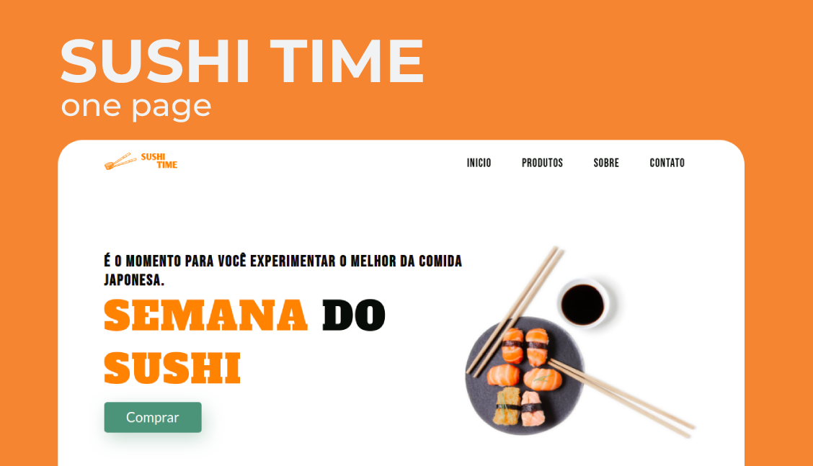
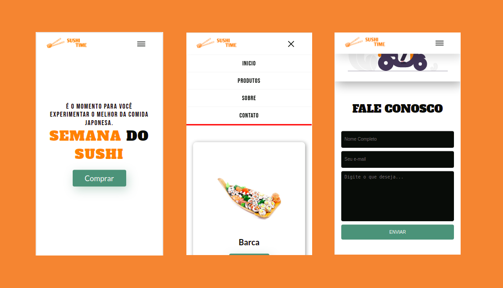

<h1 align="center">
    
     
 
</h1>

<h4 align="center">
  
</h4>

  <a href="#sobre">Sobre o projeto</a>&nbsp;&nbsp;&nbsp;|&nbsp;&nbsp;&nbsp;
  <a href="#license">Licença</a>

 

    
    
   
   

  
<h2 id="sobre">🔎 Sobre o Projeto</h2>
Projeto Front-end Web de um site one page para restaurantes. Todo a interface foi desenvolvida com uma das tecnologias para desenvolvimento de Single Page Aplications (SPA) mais consolidades: o React JS. 

<h2 id="tecnologias">⚙️ Tecnologias utilizadas</h2>
-  Figma
-  React JS
<h2>Bibliotecas</h2>
- React Scroll
- React Spinners
<h2> Como rodar</h2>

<h2 id="license"> :memo: Licença</h2>

Esse projeto está sob  a Licença MIT. Acesse [LICENSE](https://github.com/diegomagalhaes-dev/EVEN-Event-Promoter/blob/master/LICENSE) para mais informações.

Feito com ♥ por Diêgo Magalhães :wave: <a href="https://www.linkedin.com/in/magalhaesdiego/">Fale comigo!</a>.